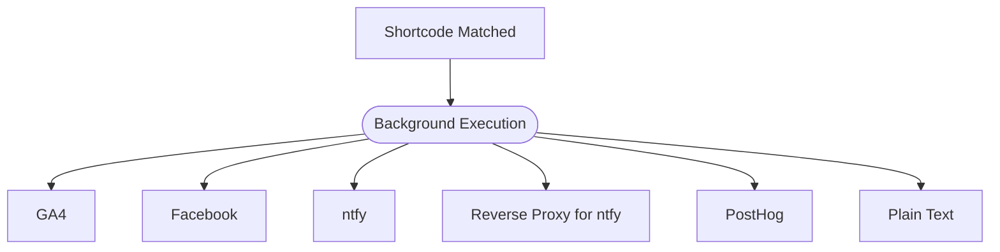

Attach server-side analytics integrations that fire automatically on every matched shortcode redirect.

## How Trackers Work

When a request matches a configured shortcode, the worker fires all configured trackers in parallel in the background so the redirect response is never delayed by analytics calls.

Individual tracker failures don't affect other trackers or the redirect. Failed trackers are silently handled — errors are not logged to the worker logs. To confirm trackers are firing, you can check the receiving service's dashboard (GA4, PostHog, etc.) or use the plain-text tracker type to send notifications to an endpoint you control.



## Tracker Types

Every tracker object requires a `name` field (unique identifier) and a `type` field that determines which additional fields are required. Extra fields are rejected.

---

### GA4 (Google Analytics 4)

Send `select_content` events to Google Analytics 4 via the Measurement Protocol server-side API.

#### Config Fields

| Field            | Type     | Required | Description                                                |
|------------------|----------|:--------:|------------------------------------------------------------|
| `name`           | `string` |    Yes   | Unique tracker name.                                       |
| `type`           | `string` |    Yes   | Must be `"ga4"`.                                           |
| `measurement_id` | `string` |    Yes   | GA4 Measurement ID (e.g., `G-XXXXXXXXXX`).                 |
| `api_secret`     | `string` |    Yes   | GA4 Measurement Protocol API secret.                       |

#### Example

```json
{
  "name": "my-ga4",
  "type": "ga4",
  "measurement_id": "G-XXXXXXXXXX",
  "api_secret": "your-api-secret"
}
```

#### Event Details

- **Endpoint:** `https://www.google-analytics.com/mp/collect`
- **Event name:** `select_content`
- **Parameters:** `content_type` (`short_link`), `content_id` (shortcode), `link_url` (redirect URL)
- **Client ID:** Extracted from the `CF-RAY` header, falls back to `"unknown"`. Note: `CF-RAY` is a Cloudflare request identifier, not a persistent user identifier. Each request generates a unique `CF-RAY`, so GA4 treats every redirect as a distinct client. This is sufficient for counting events but doesn't support user-level attribution or session tracking.

#### How to Get Your Credentials

1. Go to **Google Analytics > Admin > Data Streams > your stream**.
2. Copy the **Measurement ID** (starts with `G-`).
3. Under **Measurement Protocol API secrets**, create a new secret and copy it.

---

### Facebook

Fire a Facebook pixel PageView event via the noscript tracking endpoint.

#### Config Fields

| Field      | Type     | Required | Description                        |
|------------|----------|:--------:|------------------------------------|
| `name`     | `string` |    Yes   | Unique tracker name.               |
| `type`     | `string` |    Yes   | Must be `"facebook"`.              |
| `pixel_id` | `string` |    Yes   | Facebook Pixel ID.                 |

#### Example

```json
{
  "name": "my-facebook",
  "type": "facebook",
  "pixel_id": "123456789012345"
}
```

#### Event Details

- **Endpoint:** `https://www.facebook.com/tr?id=<pixel_id>&ev=PageView&noscript=1`
- **Method:** GET
- **Event:** PageView

#### How to Get Your Pixel ID

1. Go to **Meta Events Manager**.
2. Select your pixel under **Data Sources**.
3. Copy the **Pixel ID** from the overview page.

---

### ntfy

Send push notifications with full request details to an ntfy server when a short link is visited.

#### Config Fields

| Field    | Type     | Required | Description                                                  |
|----------|----------|:--------:|--------------------------------------------------------------|
| `name`   | `string` |    Yes   | Unique tracker name.                                         |
| `type`   | `string` |    Yes   | Must be `"ntfy"`.                                            |
| `server` | `string` |    Yes   | ntfy server URL. Must start with `https://`.                 |
| `topic`  | `string` |    Yes   | ntfy topic name.                                             |
| `token`  | `string` |    Yes   | Authentication token. Must start with `tk_`.                 |

#### Example

```json
{
  "name": "my-ntfy",
  "type": "ntfy",
  "server": "https://ntfy.sh",
  "topic": "short-links",
  "token": "tk_your-token-here"
}
```

#### Event Details

- **Endpoint:** `<server>`
- **Method:** POST with Bearer token authorization
- **Content-Type:** `application/json`
- **Body:** JSON object with `topic`, `title`, `message` (Markdown-formatted), `tags`, `priority`, and `markdown` fields. The message includes shortcode, redirect URL, request method, request URL, Cloudflare geo data (country, city, ASN, coordinates, timezone), and request headers.

#### How to Get Your Token

1. Log into your ntfy instance.
2. Go to **Account > Access Tokens**.
3. Generate a new token (starts with `tk_`).

---

### Reverse Proxy for ntfy

Send Markdown-formatted push notifications through an [ntfy-reverse-proxy](https://github.com/cbnventures/ntfy-reverse-proxy) endpoint with optional Bearer token authentication. Designed for users who deploy ntfy-reverse-proxy and configure it with a single URL instead of separate server and topic fields.

#### Config Fields

| Field   | Type     | Required | Description                                                  |
|---------|----------|:--------:|--------------------------------------------------------------|
| `name`  | `string` |    Yes   | Unique tracker name.                                         |
| `type`  | `string` |    Yes   | Must be `"ntfy-reverse-proxy"`.                              |
| `url`   | `string` |    Yes   | ntfy-reverse-proxy endpoint URL. Must start with `https://`. |
| `token` | `string` |    No    | Optional authentication token for Bearer authorization.      |

#### Example

```json
{
  "name": "my-ntfy-proxy",
  "type": "ntfy-reverse-proxy",
  "url": "https://ntfy-proxy.example.com/alerts",
  "token": "your-bearer-token"
}
```

#### Event Details

- **Endpoint:** The configured `url`
- **Method:** POST with optional Bearer token authorization
- **Content-Type:** `text/plain`
- **Headers:** `Title: User Request Received`, `Tags: rotating_light`, `Priority: 2`, `Markdown: yes`
- **Body:** Markdown-formatted message with three sections:
  - **User Request** — shortcode, redirect URL, request method, request URL.
  - **Cloudflare Properties** — city, continent, country, data center, ISP, coordinates, postal code, region, timezone.
  - **Headers** — CF-Connecting-IP, CF-IPCountry, CF-RAY, Host, User-Agent, X-Real-IP.

The payload format is identical to the ntfy tracker, making it compatible with ntfy's Markdown rendering. The difference is configuration: a single `url` pointing to your [ntfy-reverse-proxy](https://github.com/cbnventures/ntfy-reverse-proxy) endpoint instead of separate `server` and `topic` fields, and the authentication token is optional.

---

### PostHog

Capture a "User Request Captured" event to a PostHog instance with shortcode and redirect details.

#### Config Fields

| Field     | Type     | Required | Description                                               |
|-----------|----------|:--------:|-----------------------------------------------------------|
| `name`    | `string` |    Yes   | Unique tracker name.                                      |
| `type`    | `string` |    Yes   | Must be `"posthog"`.                                      |
| `host`    | `string` |    Yes   | PostHog instance URL. Must start with `https://`.         |
| `api_key` | `string` |    Yes   | PostHog project API key.                                  |

#### Example

```json
{
  "name": "my-posthog",
  "type": "posthog",
  "host": "https://app.posthog.com",
  "api_key": "phc_your-project-api-key"
}
```

#### Event Details

- **Endpoint:** `<host>/i/v0/e/`
- **Method:** POST
- **Event name:** `User Request Captured`
- **Distinct ID:** `CF-RAY` header, then `CF-Connecting-IP` header, then `"unknown"`. Since `CF-Connecting-IP` is the client's IP address, PostHog can group events by IP when `CF-RAY` is unavailable.
- **Properties:** `shortcode`, `redirect_url`, `$current_url` (original request URL)

#### How to Get Your Credentials

1. Go to **PostHog > Project Settings**.
2. Copy the **Project API Key**.
3. Your **host** is your PostHog instance URL (e.g., `https://app.posthog.com` for cloud).

---

### Plain Text

Send a plain text summary with full request and Cloudflare edge details to any webhook endpoint.

#### Config Fields

| Field   | Type     | Required | Description                                                  |
|---------|----------|:--------:|--------------------------------------------------------------|
| `name`  | `string` |    Yes   | Unique tracker name.                                         |
| `type`  | `string` |    Yes   | Must be `"plain-text"`.                                      |
| `url`   | `string` |    Yes   | Webhook endpoint URL. Must start with `https://`.            |
| `token` | `string` |    No    | Optional Bearer token for authorization.                     |

#### Example

```json
{
  "name": "my-webhook",
  "type": "plain-text",
  "url": "https://ntfy.example.com/alerts",
  "token": "your-bearer-token"
}
```

#### Event Details

- **Endpoint:** The configured `url`
- **Method:** POST with optional Bearer token authorization
- **Content-Type:** `text/plain`
- **Body:** Plain text message with three sections:
  - **User Request** — shortcode, redirect URL, request method, request URL.
  - **Cloudflare Properties** — city, continent, country, data center, ISP, coordinates, postal code, region, timezone.
  - **Headers** — CF-Connecting-IP, CF-IPCountry, CF-RAY, Host, User-Agent, X-Real-IP.

The plain text format contains the same data as the ntfy and ntfy-reverse-proxy trackers but without Markdown formatting. It can be consumed by any webhook receiver that accepts `text/plain` POST requests.

---

## Multiple Trackers

You can configure as many trackers as you need. All trackers fire on every matched shortcode redirect:

```json
{
  "trackers": [
    { "name": "analytics", "type": "ga4", "measurement_id": "G-XXX", "api_secret": "xxx" },
    { "name": "notifications", "type": "ntfy", "server": "https://ntfy.sh", "topic": "links", "token": "tk_xxx" },
    { "name": "product", "type": "posthog", "host": "https://app.posthog.com", "api_key": "phc_xxx" }
  ]
}
```

## Managing Trackers

Use the interactive menu or CLI commands:

```bash
# Interactive management
bsl
# Select "Manage trackers"

# Remove a tracker directly
bsl trackers remove my-ga4
```

The interactive menu supports add, edit, and remove operations for trackers with input validation for each tracker type's required fields.
