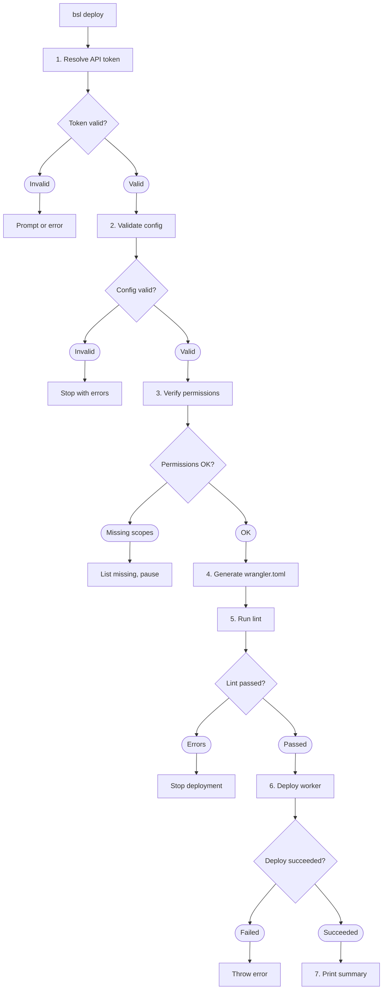

Deploy your branded short links to Cloudflare Workers with a single command that handles validation, configuration generation, linting, and deployment.



## Prerequisites

- A Cloudflare account with a registered domain.
- A Cloudflare API token with the required permissions (see below).
- A valid `config.json` with at least one link item configured.

## API Token Setup

### Create the Token

1. Go to **Cloudflare Dashboard > My Profile > API Tokens**.
2. Click **Create Token**.
3. Use the **Custom token** template.
4. Add these permissions:

| Scope   | Resource            | Permission |
|---------|---------------------|------------|
| Account | Workers Scripts     | Edit       |
| Zone    | Workers Routes      | Edit       |
| Zone    | Email Routing Rules | Edit       |

The Email Routing Rules permission is required when the Cloudflare zone has email routing enabled. The deploy process verifies all three permissions and reports which are missing.

5. Under **Zone Resources**, select the zone that contains your base domain.
6. Click **Continue to summary**, then **Create Token**.
7. Copy the token and store it securely.

### Store the Token

The CLI stores your API token in `~/.config/branded-short-links/.env`:

```text
CLOUDFLARE_API_TOKEN="your-token-here"
```

During the first deploy, if no token is found, the CLI prompts you to enter one interactively. It verifies the token against the Cloudflare API before saving.

## Deploy Command

Run the deploy from the CLI:

```bash
bsl deploy
```

Or from the interactive menu by selecting **Deploy**.

## Deployment Steps

The deploy command runs these steps in sequence:

### 1. Resolve API Token

Loads the Cloudflare API token from the `.env` file (resolved from current directory, project root, or `~/.config/branded-short-links/`) or the `CLOUDFLARE_API_TOKEN` environment variable. When run from the interactive menu, prompts you to enter a token interactively if none is found. When run directly via `bsl deploy`, throws an error instead of prompting.

### 2. Validate Config

Runs the same checks as `bsl validate`:

- Schema validation for settings, links, and trackers.
- Duplicate shortcode detection.
- Duplicate tracker name detection.

Deployment stops if validation fails.

### 3. Verify Permissions

Checks that the API token has the three required permission scopes against your configured `base_domain`. The CLI resolves the Cloudflare zone by progressively trying shorter domain segments until it finds a match.

If permissions are missing, the CLI lists which scopes need to be added and pauses for you to update the token.

### 4. Generate wrangler.toml

Creates a `wrangler.toml` file with:

- Worker name from `settings.worker_name`.
- Compatibility date (set to the current date).
- Account ID (derived from zone info during permission verification).
- Custom domain routes for the base domain. Two-part domains (e.g., `example.com`) also get a `www.` route.
- Config sections (`SETTINGS`, `LINKS`, `TRACKERS`) serialized as JSON string environment variables.
- Main entry point pointing to the built worker script.

### 5. Run Lint

Runs ESLint against the `./src` directory. Any lint error stops the deployment.

### 6. Deploy Worker

Runs `wrangler deploy --config wrangler.toml` with the account ID derived from the permission verification step. The Wrangler CLI handles uploading the worker bundle to Cloudflare.

### 7. Print Summary

Displays a summary of all configured short links with their shortcodes, redirect URLs, HTTP response codes, and attached tracker names.

## Custom Domain Routes

The CLI generates Cloudflare Workers custom domain routes based on your `base_domain`:

| Base Domain      | Generated Routes                                                 |
|------------------|------------------------------------------------------------------|
| `example.com`    | `example.com` (custom domain), `www.example.com` (custom domain) |
| `go.example.com` | `go.example.com` (custom domain)                                 |

Two-part domains automatically get a `www.` variant. Three-or-more-part domains (subdomains) get a single route.

## Cloudflare Domain Requirements

- **A registered domain is required.** You can register domains within Cloudflare at cost with no markup via [Cloudflare Registrar](https://www.cloudflare.com/products/registrar/).
- **Custom domains only.** The worker uses Cloudflare Workers custom domains (`custom_domain = true` in the generated routes). Standard Cloudflare Workers routes (`custom_domain = false`) are not supported because the shortcode matcher relies on the full path from the domain root.
- **DNS is managed automatically.** When you deploy with a custom domain, Cloudflare creates the necessary DNS records. You don't need to configure DNS manually.

## Local Development

Start a local development server with Wrangler:

```bash
npm run dev
```

This generates a temporary `wrangler.toml` if one doesn't exist and starts `wrangler dev` with a local upstream. You can test your shortcode redirects and landing page locally before deploying.

## Post-Deploy Verification

After deploying, you can verify your setup:

1. Visit `https://yourdomain.com/` in a browser. You should see the landing page (if no fallback URL is set) or be redirected to the fallback URL.
2. Visit `https://yourdomain.com/your-shortcode` and confirm it redirects to the correct destination.
3. Check your analytics dashboards (GA4, PostHog, etc.) to confirm tracker events are arriving.
4. Tail live worker logs to see redirect and tracker activity:

```bash
npm run tail
```

## Redeployment

After changing your config (adding links, updating trackers, changing settings), redeploy with the same command:

```bash
bsl deploy
```

The CLI regenerates `wrangler.toml` from the current config on every deploy, so your changes are always reflected.
