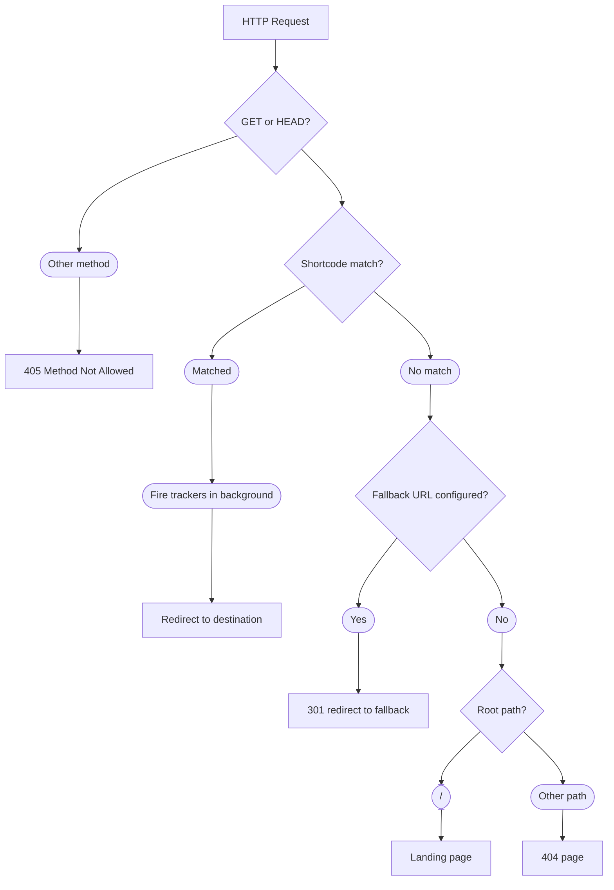

Set up Branded Short Links on your own domain in minutes with an interactive CLI and Cloudflare Workers.

## Why Use Branded Short Links?

- Direct analytics tracking via server-side APIs (GA4, Facebook, PostHog, ntfy, Reverse Proxy for ntfy, plain-text) so you don't depend on client-side JavaScript that browsers may block.
- Runs on Cloudflare Workers at the edge so redirects are fast and globally distributed with no origin server required.
- Interactive CLI manages your entire configuration so you never hand-edit JSON or TOML files.
- Custom domain support lets you run short links like `yourdomain.com/github` that look professional and memorable.
- Lightweight single-worker deployment means no databases, admin panels, or user management overhead.

## How It Works

When a request arrives at your custom domain, the Cloudflare Worker matches the path against your configured shortcodes. If a match is found, it fires all configured analytics trackers in the background and immediately returns a redirect response.

| Request                          | Result                                       |
|----------------------------------|----------------------------------------------|
| `https://yourdomain.com/github`  | Fires trackers, redirects to destination     |
| `https://yourdomain.com/resume`  | Fires trackers, redirects to destination     |
| `https://yourdomain.com/unknown` | Redirects to fallback URL (if configured)    |
| `https://yourdomain.com/`        | Redirects to fallback, or shows landing page |
| `https://yourdomain.com/missing` | Redirects to fallback, or shows 404 page     |

Tracker events fire in the background so the redirect response is never delayed by analytics. Trackers are optional — you can deploy with an empty `"trackers": []` array and add them later.

## Prerequisites

| Tool    | Version     | Purpose                                |
|---------|-------------|----------------------------------------|
| Node.js | Current LTS | Runtime for the CLI and build pipeline |

You'll also need a Cloudflare account with a registered domain. Cloudflare offers [domain registration](https://www.cloudflare.com/products/registrar/) at cost with no markup.

## Next Steps

- [Quick Start](/docs/getting-started/quick-start/) walks you through installation and first deployment.
- [Configuration](/docs/configuration/settings/) covers all config file options.
- [Trackers](/docs/configuration/trackers/) explains each analytics integration.
