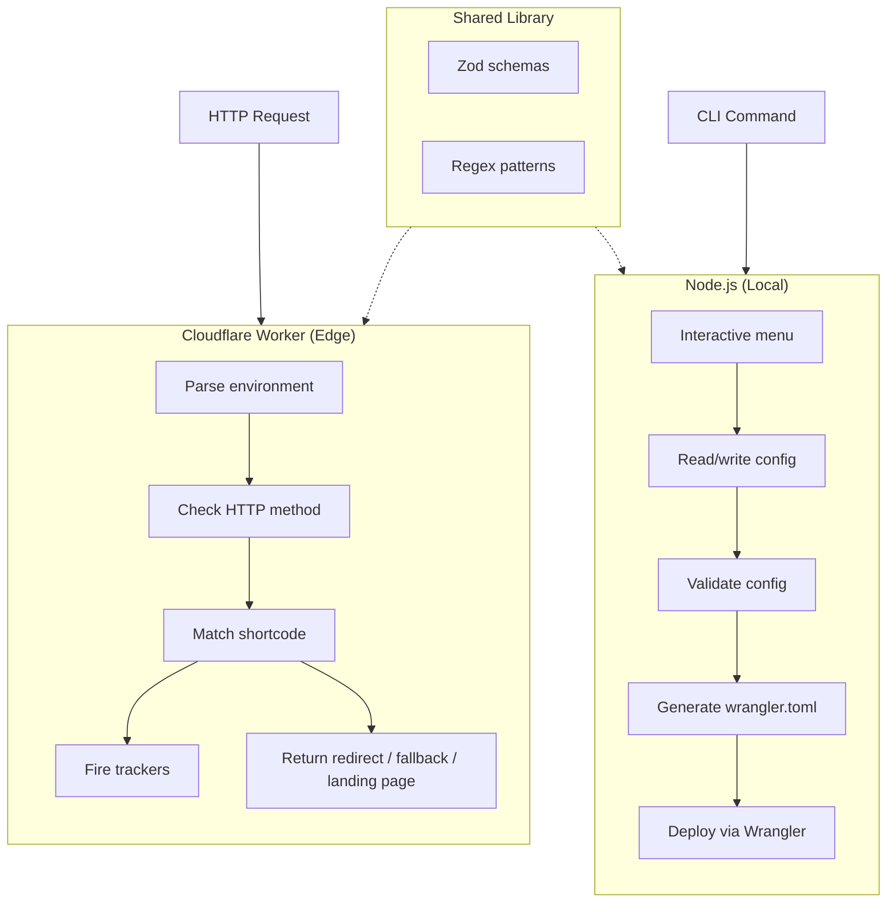
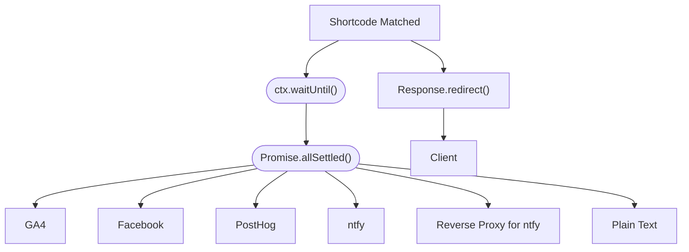
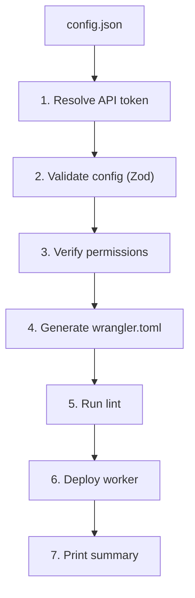

Understand how Branded Short Links routes requests, fires analytics trackers, and manages configuration across two separate runtimes.

## System Overview

The project has two entry points running on different runtimes:



The worker handles incoming HTTP requests at the edge. The CLI manages the configuration file that the worker reads at runtime.

## Request Flow

When a request arrives at the Cloudflare Worker:

1. **Parse environment** — The worker reads `SETTINGS`, `LINKS`, and `TRACKERS` from Wrangler environment variables (injected as JSON strings during deployment). It validates them against the Zod config schema.

2. **Check HTTP method** — Only `GET` and `HEAD` requests are processed. All other methods return `405 Method Not Allowed`.

3. **Match shortcode** — The URL pathname is stripped of its trailing slash and matched against the configured link items.

4. **Route the response:**

| Condition                                      | Response                                                            |
|------------------------------------------------|---------------------------------------------------------------------|
| Shortcode matched                              | Fire trackers in background, redirect with configured HTTP status   |
| No match, fallback configured, root path (`/`) | Redirect to fallback URL origin only (always 301)                   |
| No match, fallback configured, other path      | Redirect to fallback origin + original path/query/hash (always 301) |
| No match, no fallback, root path (`/`)         | Serve the branded landing page (200)                                |
| No match, no fallback, other path              | Serve the 404 not-found page (404)                                  |

5. **Log event** — Every request logs a structured JSON payload to `console.info()` with the matched shortcode (or `null`), redirect URL, HTTP response code, and tracker names. You can view these logs in real time with `npm run tail`. Example payload:

```json
{
  "shortcode": "/github",
  "redirect_url": "https://github.com/yourname",
  "http_response": 301,
  "trackers": ["my-ga4", "my-ntfy"]
}
```

## Tracker Dispatch

Trackers fire in the background so the redirect response is returned immediately:



- All trackers fire in parallel via `Promise.allSettled()`.
- Individual failures don't affect other trackers or the redirect.
- Each tracker type makes its own HTTP request to the respective service's API endpoint.

## Landing Page

When a GET request hits the root path (`/`) and no fallback URL is configured, the worker serves a branded HTML page:

- Project name and description.
- Link to the GitHub repository.
- Dark mode support via CSS custom properties (`prefers-color-scheme`).
- Fade-in animation.

When `show_response_output` is `true`, an expandable `<details>` element shows the config with sensitive values masked (`••••••`). The masking function replaces:

- **Links** — `redirect_url` on every link item.
- **GA4 trackers** — `measurement_id` and `api_secret`.
- **Facebook trackers** — `pixel_id`.
- **ntfy trackers** — `server` and `token`.
- **Reverse Proxy for ntfy trackers** — `url` and optionally `token`.
- **PostHog trackers** — `host` and `api_key`.
- **Plain-text trackers** — `url` and optionally `token`.

Settings (including `worker_name`, `base_domain`) and the `fallback_url` are shown unmasked.

A similar 404 page is served for unmatched paths when no fallback URL is configured.

## Configuration Pipeline



The config file is never deployed directly. The CLI serializes each section as a JSON string into Wrangler environment variables. The worker parses these strings back into objects at runtime.

## Source Structure

```text
packages/branded-short-links/src/
|-- worker/                 <-- Cloudflare Worker runtime
|   |-- index.ts           <-- Request handler, routing logic
|   |-- trackers.ts        <-- Tracker dispatch (GA4, Facebook, ntfy, Reverse Proxy for ntfy, PostHog, plain-text)
|   '-- landing/
|       '-- page.ts        <-- Landing page and 404 page HTML generation
|-- cli/                    <-- Node.js CLI runtime
|   |-- index.ts           <-- CLI entry point (Commander)
|   |-- commands/
|   |   |-- config-io.ts   <-- Config file read/write
|   |   |-- deploy.ts      <-- Deployment orchestration (7 steps)
|   |   |-- generate.ts    <-- wrangler.toml generation
|   |   |-- links.ts       <-- Link CRUD operations
|   |   |-- settings.ts    <-- Settings read/update
|   |   |-- trackers.ts    <-- Tracker CRUD operations
|   |   '-- validate.ts    <-- Config schema + duplicate validation
|   '-- menu/
|       '-- interactive.ts <-- Interactive TUI menu (prompts)
|-- lib/
|   |-- schema.ts          <-- Zod validation schemas (all types)
|   |-- regex.ts           <-- Centralized regex patterns
|   '-- item.ts            <-- App name constant
'-- types/                  <-- TypeScript declarations (.d.ts), mirrors src/
```

Worker code and CLI code are cleanly separated because they run on different runtimes (Cloudflare Workers vs. Node.js). They share the `lib/` directory for schemas and utilities.

## Error Strategy

| Layer              | Strategy                                                                                      |
|--------------------|-----------------------------------------------------------------------------------------------|
| Worker entry point | Try/catch wraps the entire fetch handler. Returns JSON error response on failure.             |
| Config parsing     | Zod `safeParse` at request time validates env vars. Returns 500 with error issues on failure. |
| Shortcode matching | No match falls through to fallback URL, landing page, or 404. Never crashes.                  |
| Tracker dispatch   | `Promise.allSettled()` catches individual failures silently. Never blocks.                    |
| CLI commands       | Try/catch at command level. Chalk-formatted errors. Non-zero exit code.                       |
| Config validation  | Zod schemas catch type mismatches, missing fields, invalid URLs, duplicates.                  |

## Data Collected Per Request

When trackers fire, they can access these data points from the Cloudflare Workers runtime. Each tracker type selects the subset of data relevant to its API. See [Trackers](/docs/configuration/trackers/) for what each type sends.

### Shortcode Properties

| Variable       | Description                                     |
|----------------|-------------------------------------------------|
| `shortcode`    | The matched shortcode path (e.g., `/github`).   |
| `redirect_url` | The destination URL the shortcode redirects to. |

### Request Properties

| Variable         | Source           | Description                  |
|------------------|------------------|------------------------------|
| `request_method` | `request.method` | The HTTP method (GET, HEAD). |
| `request_url`    | `request.url`    | The full request URL.        |

### Request Headers

| Variable                 | Header             | Description                                         |
|--------------------------|--------------------|-----------------------------------------------------|
| `headers_cfConnectingIp` | `CF-Connecting-IP` | The client's IP address.                            |
| `headers_cfIpCountry`    | `CF-IPCountry`     | Two-letter country code of the client (e.g., `US`). |
| `headers_cfRay`          | `CF-RAY`           | Unique Cloudflare request identifier.               |
| `headers_host`           | `Host`             | The hostname from the request.                      |
| `headers_userAgent`      | `User-Agent`       | The client's user agent string.                     |
| `headers_xRealIp`        | `X-Real-IP`        | The client's real IP when behind a proxy.           |

### Cloudflare Edge Properties

These properties come from the `request.cf` object populated by Cloudflare's edge network.

| Variable            | Source                      | Description                                                              |
|---------------------|-----------------------------|--------------------------------------------------------------------------|
| `cf_asn`            | `request.cf.asn`            | ASN of the incoming request (e.g., `395747`).                            |
| `cf_asOrganization` | `request.cf.asOrganization` | Organization that owns the ASN (e.g., `Google Cloud`).                   |
| `cf_city`           | `request.cf.city`           | City of the incoming request (e.g., `Austin`).                           |
| `cf_colo`           | `request.cf.colo`           | Three-letter IATA airport code of the data center (e.g., `DFW`).         |
| `cf_continent`      | `request.cf.continent`      | Continent code (e.g., `NA`).                                             |
| `cf_country`        | `request.cf.country`        | Two-letter country code (e.g., `US`). Same as the `CF-IPCountry` header. |
| `cf_isEUCountry`    | `request.cf.isEUCountry`    | Returns `"1"` if the country is in the EU. Omitted otherwise.            |
| `cf_latitude`       | `request.cf.latitude`       | Latitude of the incoming request (e.g., `30.27130`).                     |
| `cf_longitude`      | `request.cf.longitude`      | Longitude of the incoming request (e.g., `-97.74260`).                   |
| `cf_metroCode`      | `request.cf.metroCode`      | DMA metro code (e.g., `635`).                                            |
| `cf_postalCode`     | `request.cf.postalCode`     | Postal code (e.g., `78701`).                                             |
| `cf_region`         | `request.cf.region`         | ISO 3166-2 region name (e.g., `Texas`).                                  |
| `cf_regionCode`     | `request.cf.regionCode`     | ISO 3166-2 region code (e.g., `TX`).                                     |
| `cf_timezone`       | `request.cf.timezone`       | IANA timezone (e.g., `America/Chicago`).                                 |

### Why Direct Tracking?

Traditional tag management systems like Google Tag Manager rely on embedding JavaScript in the browser. This doesn't work for URL shorteners because browsers immediately follow the `Location` header on a 3xx redirect response instead of loading the response body, so embedded analytics scripts never execute.

Branded Short Links solves this by firing analytics trackers server-side from the Cloudflare Worker, bypassing the browser entirely. This means:

- No client-side JavaScript required.
- No dependency on browser-side tag containers.
- Tracking works even when JavaScript is blocked or disabled.
- No `http-equiv` meta refresh redirects (which are bad for SEO).
